# EcoBarter built with flutter

EcoBarter is an innovative mobile application designed to bridge the gap between local scrap collectors and customers.

## Description

EcoBarter simplifies the process of selling recyclable materials, making it easier for individuals to contribute to a greener planet. The app allows users to effortlessly connect with local scrap collectors, ensuring that recyclable materials such as plastic, metal, and paper are collected and processed efficiently. It provides a transparent comparison of prices offered by different collectors, enabling users to make informed decisions.

## Features

- Simplified Process by listing the scrap items within the app.
- Schedule pickups at your preferred date and time.
- Transparency in pricing and fairness.
- Access all your past deals within the app for easy record-keeping and reference.

## Technologies Used

- **Flutter**: For building the mobile application.
- **Firebase**: For backend services including authentication, database, and storage.

## Installation Instructions

1. **Clone the repository**:

   ```bash
   git clone https://github.com/yourusername/ecobarter.git
   cd ecobarter
   ```

2. **Set up Firebase**:

   - Create a new Firebase project on the [Firebase Console](https://console.firebase.google.com/).
   - Add an Android and/or iOS app to your Firebase project.
   - Download the `google-services.json` file (for Android) and/or `GoogleService-Info.plist` file (for iOS) and place them in the appropriate directory in your Flutter project.
   - Enable Authentication methods you plan to use (e.g., Email/Password).

3. **Install Flutter dependencies**:

   ```bash
   flutter pub get
   ```

4. **Run the app**:
   ```bash
   flutter run
   ```

## Usage Instructions

1. **Register**: Create an account using your email, username, and other details.
2. **Login**: Log in with your credentials.
3. **Home Screen**:
   - For customers: Select the type of scrap you want to sell.
   - For scrap collectors: View and manage pickup requests.
4. **Schedule Pickup**: Choose the date and time for the scrap collector to pick up your items.
5. **View Past Deals**: Access the history of your transactions within the app.

## Screenshots

- **Registration Screen**:
  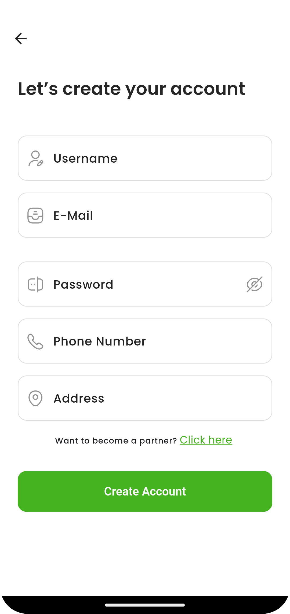

- **Login Screen**:
  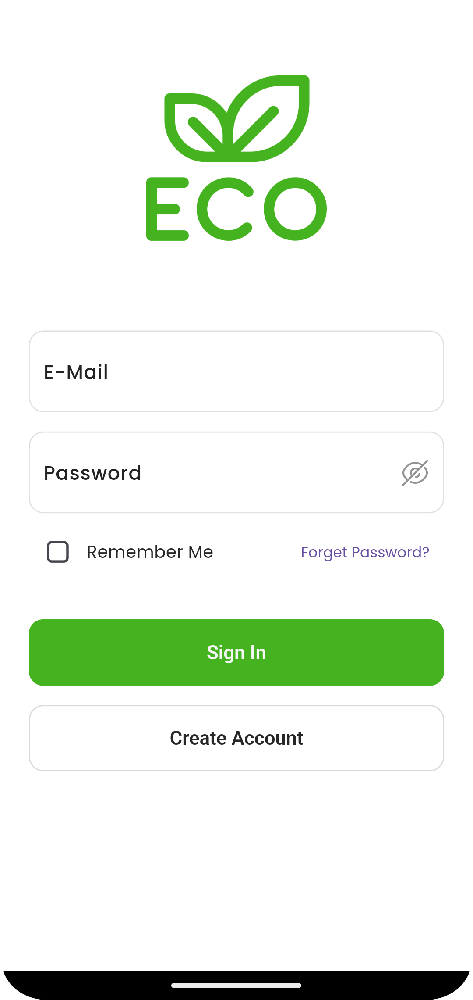

- **Home Screen (Customer)**:
  

- **Select Items Screen**:
  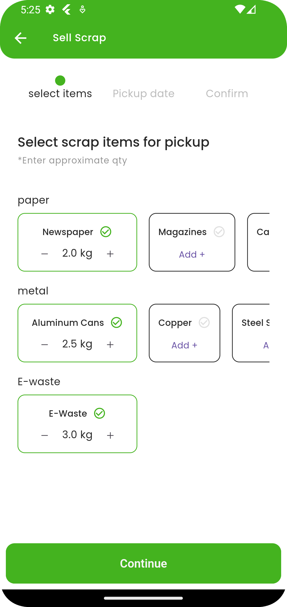

- **Select pickup date Screen**:
  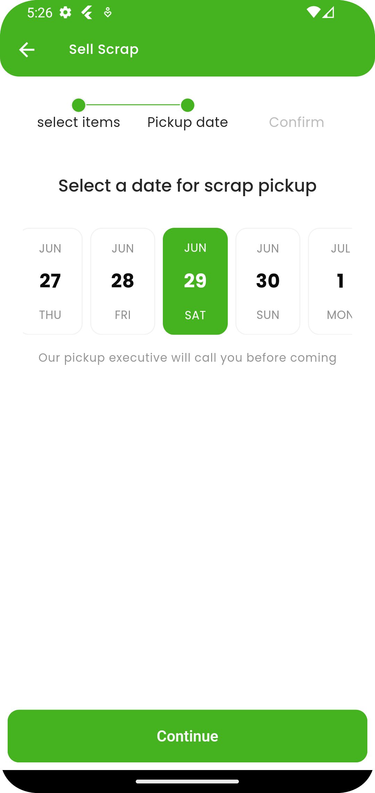

- **Select scrap collector Screen**:
  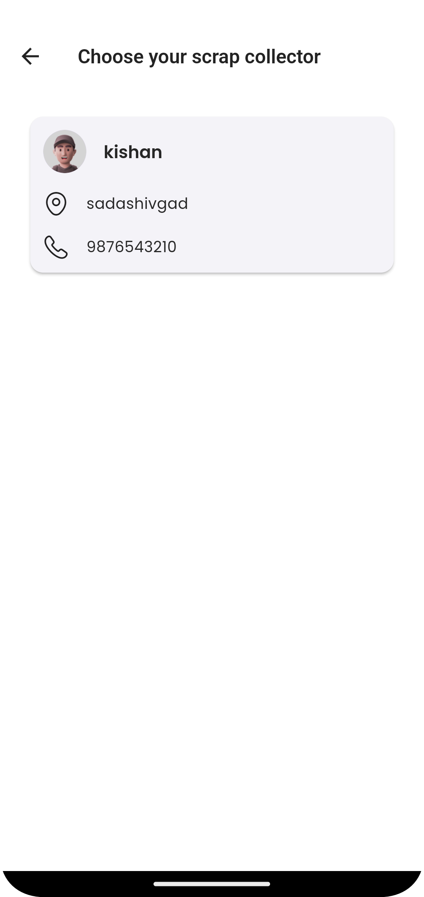

- **confirm Screen**:
  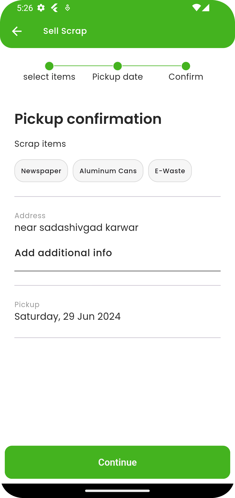

- **Select scrap collector Screen**:
  

- **Scrap collector Detail Screen**:
  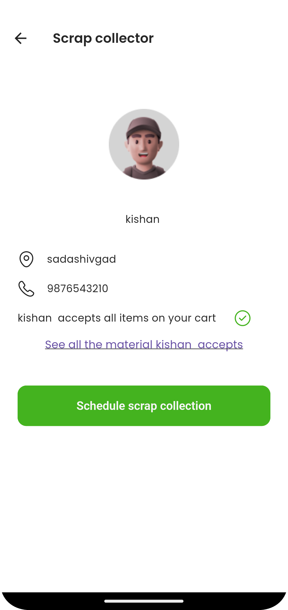

- **Pickup request history Screen**:
  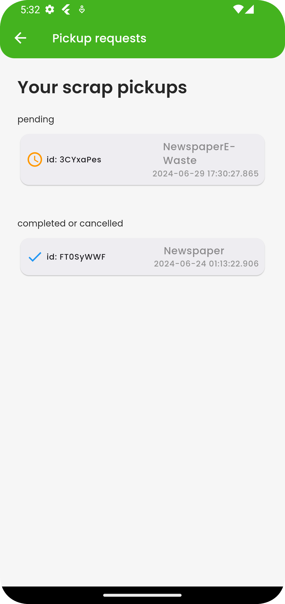

- **Scrap collector Home Screen**:
  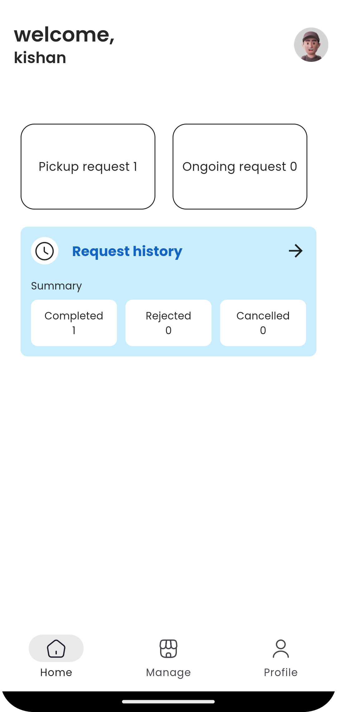

- **Accept reject Screen**:
  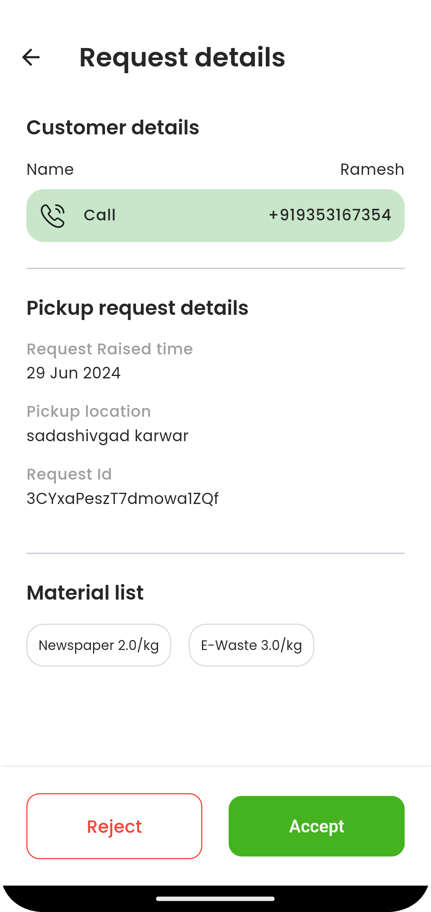

- **Checkout /bill Screen**:
  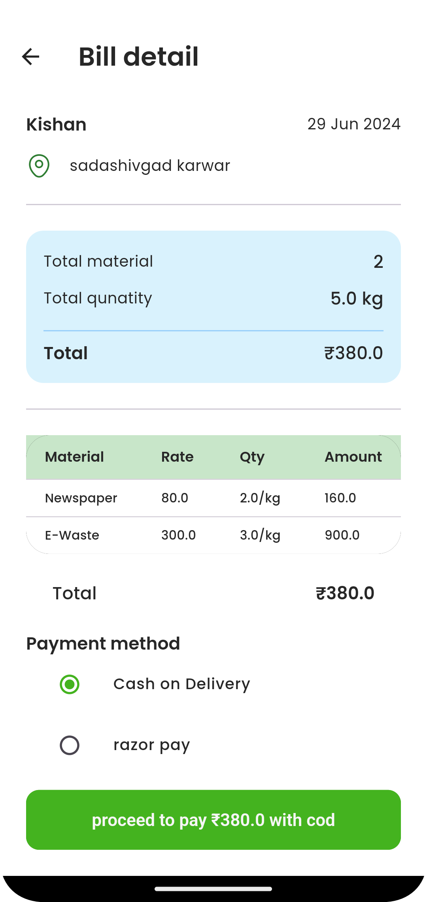

- **Add Material Screen**:
  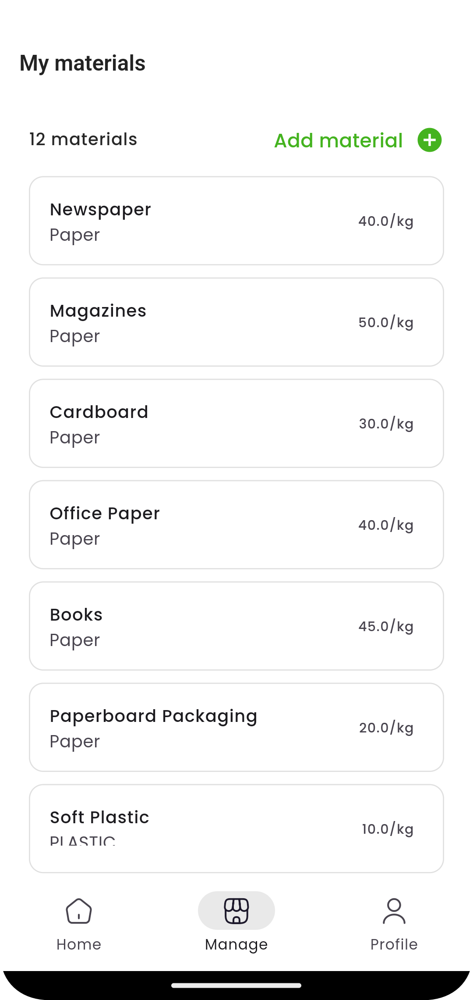

- **Partner history Screen**:
  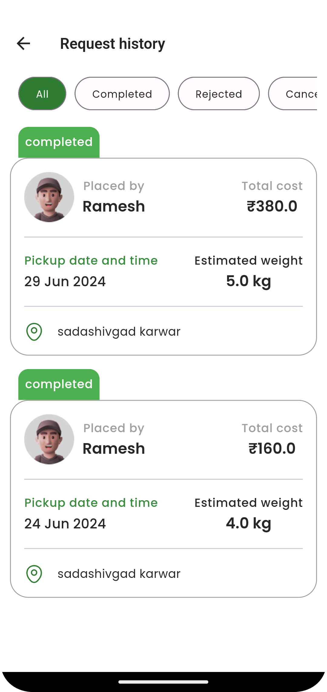

- **Profile Screen**:
  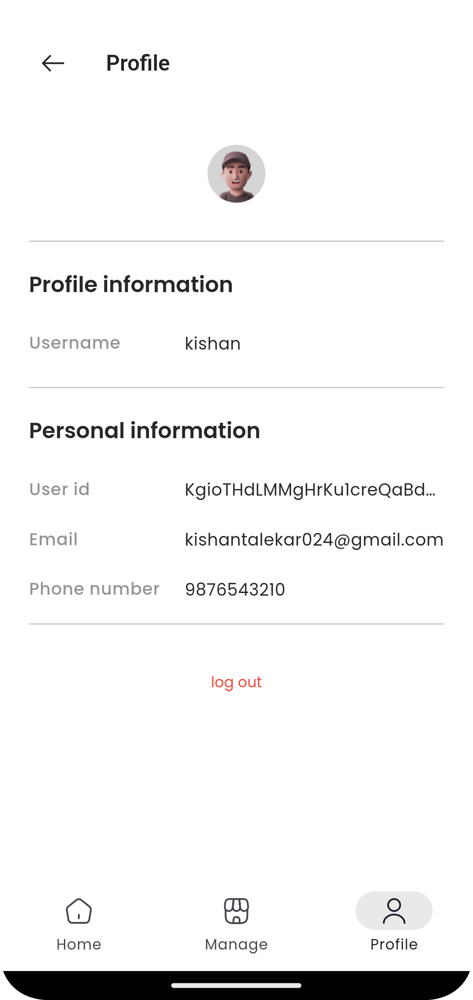

## Contributing

1. Fork the repository.
2. Create a new branch:
   ```bash
   git checkout -b feature-name
   ```
3. Make your changes and commit them:
   ```bash
   git commit -m 'Add some feature'
   ```
4. Push to the branch:
   ```bash
   git push origin feature-name
   ```
5. Open a pull request.

## Contact Information

For any questions or support related to the project, please contact:

- LinkedIn: [Kishantalekar](https://www.linkedin.com/in/kishan-talekar-2613b8260/)
- Twitter: [Kishantalekar](https://x.com/KishanTalekar)
